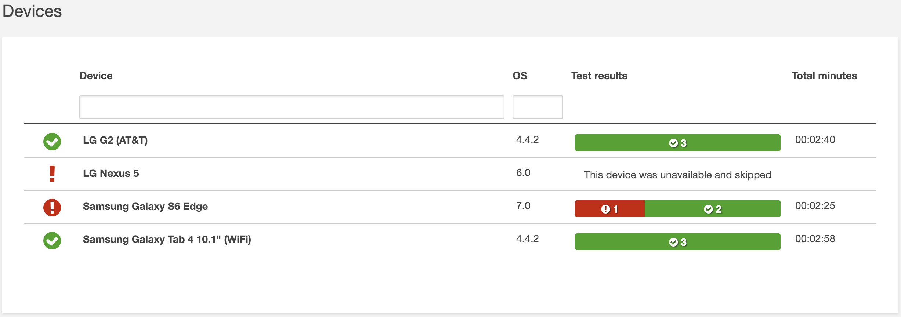

# Testing application with custom scripts using multiple devices through AWS Device Farm

## Scenario
A good test report is essential to the proper analysis of mobile app testing. It is not only the summary of test results, but also artifacts like screenshots, videos, crash reports, logs, and app-generated files. A well-formed test report provides useful insights, leads to faster resolution of issues, and helps teams focus on the right priorities. With so many great testing frameworks available, with their own strengths and weaknesses, the configuration capabilities for reports are important.

[AWS Device Farm](https://aws.amazon.com/device-farm/) provides comprehensive test reporting that includes all of the standard capabilities: screenshots, videos, and crash reports. We also know that developers need access to custom reports and artifacts that are generated by the test framework. Today, we are providing access to any custom artifact (log file, test framework generated the file, or application generated file) when accessing the test results within AWS Device Farm.

## Prerequisites

* Signed up for an AWS account 
* Download the sample APK and test APK.

## Lab tutorial
### Automated Testing with Device farm
1. Under the service menu, Choose **Device Farm** under Mobile service.

2. Enter **DemoProject** as the name.

    

3. Click **Create a new run**.

    

4. In Create a new run, Select **Android and IOS**.

5. Click **Upload**.

6. Upload the **apk-debug.apk**.

7. When you upload successful, you will see the detail of your apk.

    

8. Click **Next step**.

9. In the Configure a test, Select **Instrumentation**. 

> In this tutorial, we use Espresso and Spoon to do this automated test.

10. Upload **app-debug-androidTest.apk**.

    

11. When Upload successful, you can also see the detail of apk.

    

12. Click **Next step**.

13. At the Select devices, click **Create a new device pool**.

14. Enter **DemoPool** as Name.

15. Select some device, for this tutorial we use:

* LG G2 (AT&T)
* LG Nexus 5 
* Samsung Galaxy S6 Edge
* Samsung Galaxy Tab 4 10.1"(WiFi)

16. Click **Save device pool**.

17. Click **Next step** until Review and start run page, Click **Confirm and start run**.

18. Click your apk run.

    

19. Wait until it finishes.

>It must take some time to finish!

20. When it finishes, you will see all the devices which you selected to have the test report

    

21. Click any phone to see detail, for this tutorial we choose **LG G2 (AT&T)**.

22. In the LG G2 (AT&T) page, you can see many reports. First is Video, you can see your application progress.

    

23. Next is the Log. You can see every seconds detail, and use the filter to find the second you want to see.

    

24. You also can write some script in test apk to auto screenshot.

    

### Remote Access Testing

1. Click the DemoProject.

2. Click **Remote access**, and click **Start a new session**.

3. Type **Samsung Galaxy S5 (AT&T)** in the filter, and select it, then click **Confirm and start session**.

    

4. When it connects finish, try to upload your apk to test it yourself.

>When upload finishes, it will auto install, You can test it manually by using this real device.

    

## Clean Up
* Stop the remote device, click the button **Stop session** on the right panel

    

* Delete the project from AWS Device Farm, click **Project settings**

    

* Delete the project

    

## Conclusion

Congratulations! You now have learned how to:
* Setting the Automated testing detail.
* Use Remote Access testing app manually

